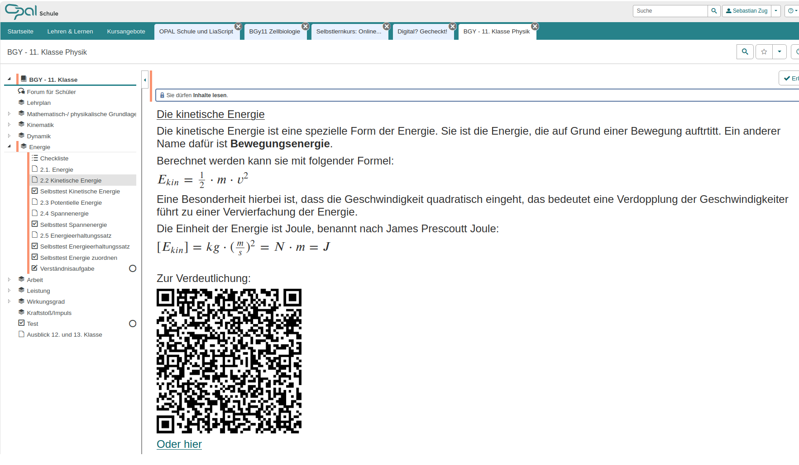

<!--
author:   Sebastian Zug, André Dietrich

email:    sebastian.zug@informatik.tu-freiberg.de

version:  0.1.1

language: de

narrator: Deutsch Male

mode:     Presentation

date:     28/05/2026

comment:  Demo-Modul ("Erleben") für den Online-Workshop
          "OPAL Schule meets LiaScript" am 28.05.2026 für die
          Referent:innen der Medienpädagogischen Zentren in Sachsen.
          Quellmaterial: ein typischer OPAL-Schule-Kurs zur Energie
          (BGY 11. Klasse Physik) — hier in einen LiaScript-Kurs überführt.

repository: https://github.com/LiaPlayground/Opal_Schule_meets_LiaScript

attribute: OPAL Schule meets LiaScript — Phase 1 (Erleben)
           von Sebastian Zug, André Dietrich
           ist lizenziert unter [CC BY-SA 4.0](https://creativecommons.org/licenses/by-sa/4.0/)

import:   https://github.com/LiaTemplates/Pyodide

translation: English  translations/English.md

-->

[](https://liascript.github.io/course/?https://raw.githubusercontent.com/LiaPlayground/Opal_Schule_meets_LiaScript/main/01_Erleben.md)

# Energie — ein Kapitel aus dem Physikunterricht der 11. Klasse

> <h3>Phase 1 des Workshops „OPAL Schule meets LiaScript"</h3>
>
> <h4>Prof. Dr. Sebastian Zug, Dr. André Dietrich</h4>
> <h4>TU Bergakademie Freiberg</h4>
>
> <h4>28. Mai 2026 — Workshop für die Medienpädagogischen Zentren</h4>

--------------------------------------------

## Worum geht es in diesem Modul?

Dieses Modul ist Ihr **erster Kontakt** mit einem fertigen LiaScript-Kurs.
Er behandelt drei Miniaturen aus einem Standard-Kapitel des Physikunterrichts der 11. Klasse — **Energie**:

1. **Energiebegriff und Energiearten** — wie *ein und derselbe Sachverhalt* in mehreren Darstellungsformen (Text, Formel, Tabelle, Video) zugänglich gemacht wird.
2. **Federpendel als interaktive Simulation** — wie eine externe PhET-Simulation *im Kurs selbst* arbeitsfähig wird, ohne den Kontext zu verlassen.
3. **Selbsttest mit automatischer Rückmeldung** — wie aus einem ONYX-Test mit Plaintext-Aufgaben drei automatisch auswertbare LiaScript-Quizformate werden.

Anschließend folgt ein kurzes **Reveal**, *woher* dieser Stoff stammt — und zum Abschluss als Highlight eine zweite Simulation, die alle drei Energiearten in einem System zusammenführt.

> [!NOTE]
> **Der Stoff dieses Moduls ist nicht erfunden.** Er stammt direkt aus einem realen [OPAL-Schule-Kurs („BGY — 11. Klasse Physik")](https://www.opal-schule.de/olat/auth/RepositoryEntry/3901030423/CourseNode/1741922335479992001).

> **Aufgabe für die nächsten 20 Minuten**
>
> Gehen Sie die Seiten durch, probieren Sie *alle* interaktiven Elemente aus und notieren Sie sich vier Dinge im gemeinsamen Pad:
>
> - Was hat Sie überrascht?
> - Welches Element würden Sie in einer Schul-Fortbildung zeigen?
> - Was möchten Sie im Tutorial-Teil unbedingt lernen?
> - Was hat vielleicht anders funktioniert als erwartet?

> [!TIP]
> **Bedienung:** Mit den **Pfeiltasten** (← / →) blättern Sie zwischen den Folien. Mit dem **Lautsprecher-Symbol** (oben rechts) aktivieren Sie das automatische Vorlesen. Über das **DE-Symbol** oben rechts schalten Sie die Sprache um (für DaZ-Lernende relevant). Rechts oben über das **i-Symbol** sehen Sie die Metadaten dieses Kurses.

## Bedienung im Überblick

Drei wiederkehrende Bausteine helfen Ihnen, sich zu orientieren:

- **Tipp** (💡, gelb hinterlegt) — Definitionen, Begriffsklärungen und Bedienhinweise.
- **Note** (blau hinterlegt) — *worauf* Sie in diesem Abschnitt achten sollten.
- **Mini-Aufgabe** — kleine Explorationsaufgaben, oft mit ausklappbarer Lösung.

> [!NOTE]
> **Bitte scrollen Sie auf jeder Seite bis ganz nach unten** — Code-Blöcke, Quizze und Lösungen stehen oft *unterhalb* des sichtbaren Bereichs.

## 1. Energiebegriff und Energiearten

> [!NOTE]
> **Worauf Sie in diesem Abschnitt achten sollten:** Derselbe Sachverhalt wird in *vier verschiedenen Darstellungen* angeboten — Video, Fließtext, Formel, Tabelle. Lehrkraft und Klasse können zwischen ihnen wechseln, ohne den Tab zu verlassen. Genau das ist gemeint mit *Lehrmaterial ohne Medienbrüche*.

### Video als Einstieg

!?[](https://www.youtube.com/watch?v=nMkShHUV5y8 "simpleclub: Kinetische Energie / Bewegungsenergie")

> [!TIP]
> **Definition:** Energie im physikalischen Sinne gibt die **Fähigkeit an, etwas zu verrichten** — Arbeit, Strahlung, Wärme oder eine Mischform daraus. Energie ist eine **Zustandsgröße**. Die Einheit ist 1 Joule (J), benannt nach James Prescott Joule.

### Alltagssprache vs. Physik

Im **Alltag** wird Energie eher als Stimmungszustand verstanden: *„Ich habe keine Energie"*, *„Wir verbrauchen zu viel Energie"*. Im **physikalischen Sinne** ist Energie eine *messbare Größe* — und ihre Veränderung tritt nur dann auf, wenn etwas verrichtet wird.

### Die drei zentralen Energiearten

| Energieart           | Formel                          | Wann tritt sie auf?                                          |
| -------------------- | ------------------------------- | ------------------------------------------------------------ |
| **Kinetische Energie** | $E_\text{kin} = \tfrac{1}{2}\, m\, v^2$ | Ein Körper bewegt sich mit Geschwindigkeit $v$.              |
| **Potentielle Energie**| $E_\text{pot} = m\, g\, h$              | Ein Körper befindet sich auf Höhe $h$ über dem Bezugspunkt.   |
| **Spannenergie**       | $E_\text{spann} = \tfrac{1}{2}\, D\, s^2$ | Eine Feder ist um die Strecke $s$ ausgelenkt (Federkonstante $D$). |

> [!TIP]
> Die Formeln sind hier als **LaTeX** gesetzt. Im Tafelbild lassen sich Brüche, Indizes und Wurzeln sauber darstellen — anders als beim Copy-Paste aus einem Word-Dokument, wo Formeln häufig zu Zeichenketten wie `Ekin=12⋅m⋅v2` zerfallen.

### Die Sache mit dem Quadrat

Eine Besonderheit der kinetischen Energie: Die Geschwindigkeit geht **quadratisch** ein.

> Eine **Verdopplung** der Geschwindigkeit führt zu einer **Vervierfachung** der kinetischen Energie.

**Mini-Aufgabe:** Um welchen **Faktor** ändert sich $E_\text{kin}$, wenn ein Auto seine Geschwindigkeit **verdreifacht**?

[[9]]
- [[?]] Hinweis: Die Geschwindigkeit geht **quadratisch** ein — überlegen Sie, was $3^2$ ergibt.
***********************************************

Die Energie verneunfacht sich ($3^2 = 9$). Das ist der Grund, warum Bremswege im Straßenverkehr so dramatisch von der Geschwindigkeit abhängen — und ein klassisches Beispiel für den Anwendungsbezug, mit dem sich der Begriff im Unterricht greifbar machen lässt.

***********************************************

## 2. Federpendel — eine Simulation im Kurs

> [!TIP]
> **Definition:** **Spannenergie** ist eine spezielle Form der potentiellen Energie. Sie ist die Energie, die eine Feder besitzt, wenn sie gespannt oder auseinandergezogen ist:
>
> $E_\text{spann} = \tfrac{1}{2}\, D\, s^2$ 
>
>mit Federkonstante $D$ und Auslenkung $s$.

> [!NOTE]
> **Worauf Sie in diesem Abschnitt achten sollten:** Die PhET-Simulation des Federpendels läuft **direkt eingebettet** in dieser Seite — kein Tab-Wechsel, keine zweite Anwendung, keine verlorene Aufgabenstellung. Das ist im klassischen OPAL-Kurs nicht möglich; dort ist der Link auf PhET ein „Verlassen-Sie-bitte-den-Kurs"-Schalter.

### Die Simulation

<!-- style="height: 700px;" -->
??[PhET-Simulation: Federpendel](https://phet.colorado.edu/sims/html/masses-and-springs/latest/masses-and-springs_de.html "Federpendel — Massen, Federn, Energie")

> **Aufgabenstellung:** Stellen Sie einen Idealzustand her, indem Sie:
>
> 1. Auf **Pause** stellen, **Gravitation = keine** und **Dämpfung = keine** wählen.
> 2. Die Linie **Auslenkung** aktivieren.
> 3. Eine Masse anhängen und die Feder leicht auslenken.

> Formulieren Sie zunächst für sich jeweils einen **„Je-desto-Satz"** über den Einfluss von **Auslenkung**, **Federkonstante**, **Masse** und **Gravitation** auf $E_\text{spann}$ *(für die Gravitation darf der Regler jetzt bewegt werden)*. Kreuzen Sie anschließend an, welche Aussagen Ihre Beobachtungen stützen:

- [[X]] Je größer die **Auslenkung** $s$, desto deutlich größer $E_\text{spann}$ — **quadratischer** Zusammenhang.
- [[X]] Je größer die **Federkonstante** $D$, desto größer $E_\text{spann}$ — **linearer** Zusammenhang.
- [[ ]] Die **Masse** $m$ beeinflusst $E_\text{spann}$ direkt.
- [[ ]] Eine ausgelenkte Feder besitzt **nur dann** Spannenergie, wenn auch die Gravitation wirkt.
- [[?]] Hinweis: Werfen Sie noch einmal einen Blick auf die Formel $E_\text{spann} = \tfrac{1}{2}\, D\, s^2$ — welche der vier Größen tauchen darin überhaupt auf?
***********************************************

- **Auslenkung:** Je größer die Auslenkung $s$, desto **deutlich** größer $E_\text{spann}$ — quadratischer Zusammenhang.
- **Federkonstante:** Je größer $D$, desto größer $E_\text{spann}$ — linearer Zusammenhang.
- **Masse:** Die Masse beeinflusst $E_\text{spann}$ **nicht direkt** — sie wirkt nur indirekt über die statische Auslenkung im Gravitationsfeld.
- **Gravitation:** Im idealisierten Fall ohne Gravitation entfällt $E_\text{pot}$; die Spannenergie selbst ist gravitationsunabhängig.

***********************************************

### Spannenergie ausrechnen — mit ausführbarem Code

> [!TIP]
> Manchmal genügt es nicht, die Formel zu kennen — wir wollen die Energie für konkrete Werte ausrechnen. Im folgenden Code-Block können Sie das **direkt im Browser** tun (Python via Pyodide, kein lokales Setup nötig).
>
> **Probieren Sie es:** Klicken Sie auf den **▶-Button** unten links am Code. Ändern Sie anschließend `s = 0.71` auf `s = 1.42` (Verdopplung) und führen Sie den Code erneut aus — was passiert mit dem Ergebnis?

```python   spannenergie.py
# Federspannenergie E_spann = 1/2 * D * s^2
D = 1.1     # Federkonstante in N/m
s = 0.71    # Auslenkung in m

E_spann = 0.5 * D * s**2
print(f"Federspannenergie: {E_spann:.3f} J")

# Aufgabe: Verdoppeln Sie s und beobachten Sie das Ergebnis.
# Hinweis: Wegen des Quadrats wird E_spann vervierfacht!
```
@Pyodide.eval

> [!NOTE]
> Genau dasselbe Code-Beispiel könnte später in einer „Hausaufgabe für die nächste Stunde" stehen — die Schülerin oder der Schüler löst die Aufgabe daheim, ohne Python lokal installieren zu müssen, und vergleicht ihr/sein Ergebnis am Smartboard mit der Lösung der Lehrkraft.

## 3. Selbsttest — drei Quizformate

> [!TIP]
> **Recap:** Energieerhaltung in einem abgeschlossenen System bedeutet, dass die Gesamtenergie konstant bleibt — sie wird lediglich zwischen Energieformen *umgewandelt*.

> [!NOTE]
> **Worauf Sie in diesem Abschnitt achten sollten:** Im Original-OPAL-Kurs sind Selbsttests in **ONYX** abgelegt — einem separaten System mit eigenem Editor und eigenem Workflow. Hier sehen Sie dieselben Fragen direkt in der Markdown-Datei, **automatisch auswertbar**, mit Hinweisen und Lösungswegen.

### Aufgabe 1 — Kinetische Energie berechnen *(Zahleneingabe)*

Ein Ball mit der Masse $m = 4\,\text{kg}$ rollt mit der Geschwindigkeit $v = 27\,\text{m/s}$.
Berechnen Sie die kinetische Energie $E_\text{kin}$ in Joule.

    [[1458]]

- [[?]] Hinweis: $E_\text{kin} = \tfrac{1}{2}\, m\, v^2$ — achten Sie auf das Quadrat.
- [[?]] Stolperstelle: $27^2 = 729$, anschließend $\cdot 4 = 2916$, dann $\cdot \tfrac{1}{2} = 1458$.
***********************************************

$E_\text{kin} = \tfrac{1}{2} \cdot 4\,\text{kg} \cdot (27\,\text{m/s})^2 = 2 \cdot 729\,\text{J} = 1458\,\text{J}$
***********************************************

### Aufgabe 2 — Abhängigkeiten der Federspannenergie *(Mehrfachauswahl)*

Welche Größen beeinflussen $E_\text{spann}$ in einem **reibungsfreien, idealisierten** Aufbau?

- [[X]] Auslenkungsweg $s$
- [[ ]] Gravitation $g$
- [[X]] Federkonstante $D$
- [[ ]] Masse $m$
- [[?]] Hinweis: Schauen Sie noch einmal auf die Formel $E_\text{spann} = \tfrac{1}{2}\, D\, s^2$ — welche Variablen tauchen darin tatsächlich auf?
***********************************************

Im idealisierten Fall hängt $E_\text{spann}$ **nur** von $D$ und $s$ ab. Masse und Gravitation wirken nicht direkt; sie bestimmen lediglich die *statische* Ruhelage der Feder im Schwerefeld — und damit, von welchem Punkt aus die Auslenkung $s$ gemessen wird.

***********************************************

### Aufgabe 3 — Geschwindigkeit zurückrechnen *(Einfachauswahl)*

Ein Elefant mit $m = 943\,\text{kg}$ besitzt eine kinetische Energie von $E_\text{kin} = 116{,}400\,\text{J}$.
Wie schnell ist er ungefähr?

- [( )] etwa $5\,\text{m/s}$
- [(X)] etwa $15{,}7\,\text{m/s}$
- [( )] etwa $123\,\text{m/s}$
- [( )] etwa $246\,\text{m/s}$
- [[?]] Hinweis: Stellen Sie die Formel nach $v$ um — $v = \sqrt{2\, E_\text{kin} / m}$.
***********************************************

$v = \sqrt{\dfrac{2 \cdot 116{,}400\,\text{J}}{943\,\text{kg}}} = \sqrt{246{,}87\,\text{m}^2/\text{s}^2} \approx 15{,}7\,\text{m/s}$

Knapp 57 km/h — ein flotter Elefant.

***********************************************

## 4. Das Reveal — woher kommt dieser Kurs?

Sie haben in diesem Modul ein **kompaktes, didaktisch aufbereitetes Kapitel** zum Energiebegriff durchgearbeitet. Alles, was Sie hier gesehen haben — Definitionen, Formeln, eingebettete Simulationen, Video, Quizze, Lösungswege — steckt in **einer einzigen Markdown-Datei**.

> [!NOTE]
> **Diese Markdown-Datei wurde aus einem OPAL-Schule-Kurs erstellt.** Konkret aus „BGY — 11. Klasse Physik". Der Original-Stoff ist 1:1 in [`Energie.md`](https://github.com/LiaPlayground/Opal_Schule_meets_LiaScript/blob/main/original_material/Energie.md) abgelegt — so, wie er beim Copy-Paste aus OPAL herauskam: Formeln als zerlegte Unicode-Schnipsel ($𝐸𝑘𝑖𝑛=12⋅𝑚⋅𝑣2$ statt $E_\text{kin} = \tfrac{1}{2}\,m\,v^2$), Quizze als Plaintext-Aufzählungen, Checklisten als kontextlose Bullet-Wüste.



*Der Original-Kurs in OPAL Schule (Screenshot ergänzt von S. Zug, Login-Wand entfernt) — Quelle: <https://www.opal-schule.de/olat/auth/RepositoryEntry/3901030423>.*

### Vorher vs. Nachher im direkten Vergleich

| Aspekt                  | OPAL-Original (Copy-Paste)                                                  | LiaScript-Version (dieser Kurs)                                                 |
| ----------------------- | --------------------------------------------------------------------------- | ------------------------------------------------------------------------------- |
| **Formeln**             | Unicode-Schnipsel, nicht lesbar                                             | LaTeX, sauber gesetzt, vergrößerbar                                             |
| **Simulationen**        | Externe Links (Tab-Wechsel)                                                 | Direkt eingebettet, kein Kontextverlust                                         |
| **Selbsttests**         | Separates ONYX-System, eigener Editor                                       | Im Markdown selbst, automatisch ausgewertet                                     |
| **Lösungen**            | Versteckt im LMS-Backend                                                    | Inline ausklappbar, mit Lösungsweg                                              |
| **Anpassbarkeit**       | An den OPAL-Kurs gebunden                                                   | Eine Datei — überall einsetzbar, anpassbar, teilbar                             |
| **Sprache / Vorlesen**  | nicht vorgesehen                                                            | Vorlesen + 100+ Sprachen per Knopfdruck                                         |
| **Veröffentlichung**    | Innerhalb OPAL                                                              | OPAL, GitHub, Dropbox, USB-Stick, QR-Code …                                     |
| **Externe Medien**      | edupool, SODIX usw. nur mit Schul-Login                                     | gleiche Quellen *plus* freie Medien aus Wikimedia/PhET/YouTube nebeneinander    |

> [!TIP]
> **Genau diese Transformation** — vom OPAL-Rohstoff zur LiaScript-OER — üben Sie in den folgenden Phasen des Workshops:
>
> - **Phase 2 (Verstehen):** Welche Konzepte machen LiaScript so anpassungsfähig?
> - **Phase 3 (Anwenden):** Sie bekommen `Energie.md` als Rohling und bauen daraus selbst — zunächst per Hand, dann mit KI-Unterstützung — einen LiaScript-Kurs.
> - **Phase 4 (Verbreiten):** Wie kommt Ihr fertiger Kurs zurück nach OPAL Schule — und in die Hände Ihrer Lehrkräfte?
